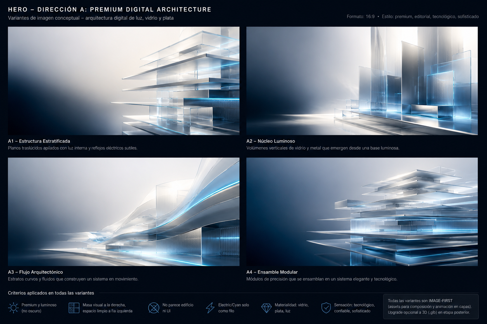
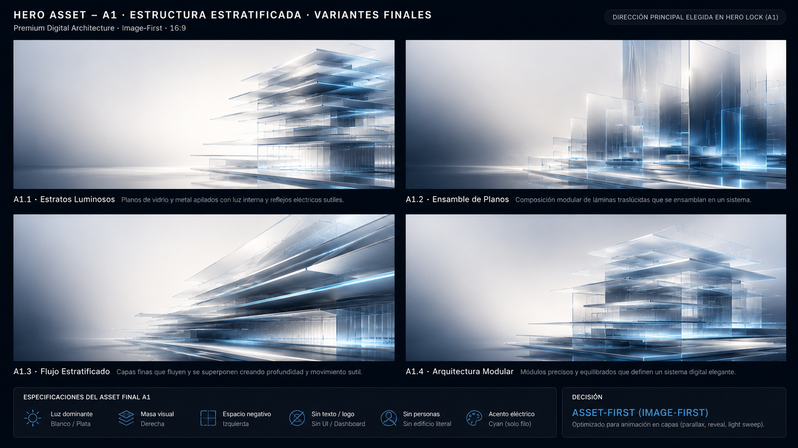

# Reference Lock — hero

> **APPROVED.** Asset final aprobado:
> `docs/reference-locks/assets/hero-a1-stratos-luminosos-final.png`.
> El Hero se implementa **contra este asset** (image-first). NO reinventar un
> protagonista visual desde código.

## Objetivo comercial / rol en la landing
Primera impresión y `<h1>` único. Debe vender en ~2s: **SYNTRA crea sistemas
digitales premium para negocios reales**. Es la **pieza-firma** de la marca: la
sección más impactante de la landing (más que Casos). Emoción: premium, viva,
memorable, tecnológica, confiable, sofisticada. KPI: reflejo del valor <2s +
deseo de seguir + clic en CTA primario.

## Referencias aprobadas

### ✅ Asset final aprobado (referencia principal de producción)

`docs/reference-locks/assets/hero-a1-stratos-luminosos-final.png` — 1672×941 (16:9).
Estructura de **estratos de vidrio/plata luminosos** a la derecha, **espacio negativo
navy a la izquierda**, reflejos electric/cyan como filo. **Este es el protagonista
visual del Hero.** El código lo **compone y anima** (image-first); no lo reemplaza.

**Qué se toma del asset final:**
- la imagen tal cual como protagonista (estratos de vidrio/plata, luz blanca/plata);
- la masa visual a la derecha;
- el espacio negativo a la izquierda (para el texto);
- los reflejos electric/cyan sutiles como filo;
- la base navy / fondo oscuro premium.

**Qué NO se toma / NO se hace:**
- NO reinventar un protagonista visual desde código (tubos, waves, glass cores,
  cápsulas, objetos 3D nuevos, dashboards, abstractos nuevos);
- NO recortar el asset perdiendo la masa derecha o el espacio negativo izquierdo;
- NO tapar el asset con UI/elementos que compitan;
- NO romper la legibilidad del texto sobre la zona negativa.

### Boards de contexto (dirección, NO assets de producción)
**Board 1 — moodboard de dirección (owner eligió A1 — Premium Digital Architecture):**

`docs/reference-locks/assets/hero-premium-digital-architecture-board.png`

**Board 2 — variantes finales de A1 (owner eligió A1.1):**

`docs/reference-locks/assets/hero-a1-variant-board.png`

- **Variante elegida: A1.1 — Estratos Luminosos** (cuadrante sup-izq): planos de
  vidrio/plata estratificados, luz blanca/plata dominante, masa visual a la
  derecha, espacio negativo limpio a la izquierda, estructura digital elegante,
  reflejos electric/cyan muy sutiles, estética editorial premium.
- **Inspiración secundaria: A1.4 — Arquitectura Modular** (cuadrante inf-der):
  solo como inspiración de precisión modular, capas ordenadas, arquitectura
  digital y profundidad.
- **Descartadas:** A1.2 — Ensamble de Planes (demasiado skyline/edificio) ·
  A1.3 — Flujo Estratificado (demasiado wave/cinta). No usar.

> Los boards son **referencia de dirección**, NO el asset final de producción. El
> lock queda en `draft`: falta generar el **asset final individual limpio** de
> A1.1 y que el owner lo apruebe (ver "Próximos assets necesarios").

Anti-referencias (en `stash@{0}` y memoria de la sesión, NO aplicar):
- SVG arc (plano, sin wow).
- R3F tube (palo/tubo negro).
- R3F wave field (cintas gruesas/oscuras + cápsulas básicas).
- R3F glass core (objeto oscuro poco visible, fondo apagado).

## Qué se toma de cada referencia
**De A1.1 — Estratos Luminosos (elegida):**
- planos de vidrio/plata estratificados;
- luz blanca/plata dominante;
- masa visual clara a la derecha;
- espacio negativo limpio a la izquierda;
- estructura digital elegante;
- reflejos electric/cyan muy sutiles;
- sensación de sistema diseñado;
- estética editorial premium.

**De A1.4 — Arquitectura Modular (solo inspiración secundaria):**
- precisión modular;
- capas ordenadas;
- sensación de arquitectura digital;
- profundidad.

## Qué NO se toma
**Del artefacto board (NO replicar):** títulos · labels · board layout · marcos ·
footer · íconos.
**Visual:** edificios literales · torres · ventanas · UI · dashboard · personas ·
wave/cintas protagonistas · exceso de cyan · (además: nodos/circuitos, tubos
negros, cápsulas flotantes, orbes/cubos AI, gamer/crypto, fondo todo azul oscuro).

## Dirección visual elegida
**Premium Digital Architecture — Estructura Estratificada (A1).** Protagonista =
asset visual premium (planos de vidrio/plata estratificados) aprobado antes del
código y compuesto/animado en capas (motion sutil); A4 como inspiración de
ensamble/profundidad. Texto limpio a la izquierda, masa a la derecha, luz
blanca/plata dominante. Code-first descartado como camino del protagonista.

## Decisión asset-first / code-first
**asset-first (image-first), híbrido-capaz.** El protagonista NO se inventa desde
código. Se aprueba el asset/referencia ANTES de codear; el código solo compone y
anima (capas, parallax sutil, reveal, motion premium). Upgrade opcional a 3D
asset-first (`.glb` modelado en herramienta externa) si el owner lo autoriza.

## Signature Palette Exception

**¿Aplica excepción de paleta?** sí

**Justificación:** el Hero es pieza-firma; forzar el 90/10 azul + near-black fue
causa directa de objetos oscuros/apagados. Necesita poder brillar.

**Colores/materiales habilitados:** blanco/luz dominante, plata, vidrio /
translúcidos, reflejos eléctricos, gradientes más ricos, un acento no-azul
controlado (a definir en la referencia aprobada).

**Límites de uso:** electric + blanco dominantes; cyan solo como filo/acento
(no masa, no neón múltiple); un solo acento no-azul máximo; sin arcoíris, sin
glow excesivo, sin partículas/starfield.

**Cómo se mantiene la marca SYNTRA:** base navy/slate del sitio, electric como
estructura, sobriedad y mucho espacio negativo (ancla Linear/Vercel/Stripe).

**Cómo se protege la legibilidad:** scrim/zona de calma para el texto; contraste
AA del H1, subcopy y CTAs garantizado sobre el asset.

Referencia: `docs/creative-library/signature-palette-exception.md`

## Criterios binarios de aprobación
- [ ] El protagonista se lee **premium y luminoso**, NO oscuro/pesado, en screenshot estático.
- [ ] Hay **un** protagonista con foco, borde y masa que balancea el H1 (no textura difusa).
- [ ] Vende el valor en <2s; H1 legible inmediato (LCP rápido).
- [ ] No parece dashboard/chat/browser/nodos/cápsulas/tubos.
- [ ] No parece gamer/crypto/AI-template; no es "todo azul".
- [ ] Excepción de paleta respetada (electric+blanco dominantes, cyan filo, 1 acento máx).
- [ ] Legibilidad AA de H1/subcopy/CTAs sobre el asset.
- [ ] 1920 no desaprovechado; 1024–1279 resuelto; 390/360 con presencia real.
- [ ] reduced-motion = estado final estático; CLS 0.
- [ ] Lighthouse mobile +95 (o explicación clara).
- [ ] El asset protagonista está aprobado por el owner ANTES de implementar.

## Riesgos visuales
Asset stocky/AI-genérico si no se cura; perder "SYNTRA" por sobre-libertad de
paleta; protagonista que compite con el H1 en vez de balancearlo.

## Riesgos técnicos / performance
Above-the-fold: peso del asset (optimizar `.webp`/`.avif`), LCP, motion en capas
sin CLS; si se va a 3D `.glb`: WebGL desktop-only + fallback mobile + DPR cap +
dynamic ssr:false.

## Próximos assets necesarios
Los boards son referencia de dirección, NO el asset de producción. Falta generar
el **asset final individual limpio** de A1.1:
```
Archivo: docs/reference-locks/assets/hero-a1-stratos-luminosos-final.png
Premium Digital Architecture — Estratos Luminosos.
Imagen 16:9 limpia.
Planos translúcidos de vidrio/plata.
Luz blanca/plata dominante.
Masa visual a la derecha.
Espacio negativo limpio a la izquierda.
Reflejos electric/cyan solo como filo.
Sin texto · sin UI · sin dashboard · sin personas · sin edificio literal ·
sin logo · sin marco · sin labels.
```
Optimizar a `.webp/.avif` antes de cualquier código, y que el owner apruebe el
asset final. (También: variante 1:1/9:16 para fallback mobile.)

## Owner approval

Estado: draft

<!-- Solo el owner pasa a 'approved'. Pendiente: generar y aprobar el asset final de A1. -->
