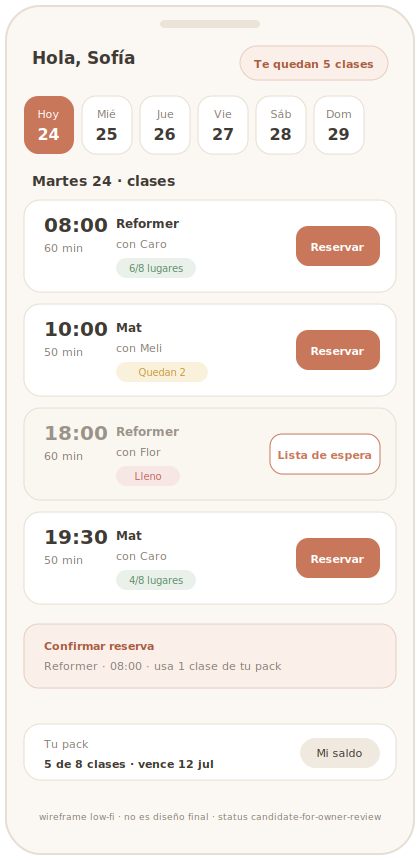

# Reference Lock — Calendario del alumno

## Objetivo de pantalla
Que el alumno **encuentre y reserve su clase en 2 toques** desde el celular, viendo de un
vistazo qué horarios tienen lugar y cuáles están llenos. Es la pantalla más usada del
producto y la cara del flujo de reserva.

## Usuario principal
**Alumno del estudio**, mobile, a menudo apurado (reserva la clase de mañana desde el sillón
o saliendo del trabajo). Puede no ser experto en apps. UX MVP: pertenece a **1 estudio
principal** (sin selector de estudio).

## Problema que resuelve
Hoy el alumno pregunta por WhatsApp "¿hay lugar mañana 18 h?" y espera respuesta. Esta
pantalla le da **autonomía**: ve el cupo real y reserva solo, sin intermediarios.

## Información prioritaria (orden)
1. **Clases de la semana** por día.
2. **Cupo en vivo** por clase ("6/8" o "Lleno").
3. **Hora + nombre de la clase** (+ instructor si aplica, informativo).
4. **Estado de mi saldo** ("te quedan N clases" / membresía activa).
5. Acción primaria: **Reservar** / **Lista de espera** (si está llena).

## Jerarquía visual
- Mobile-first: navegación por **día** (tabs / scroll horizontal), lista vertical de clases
  del día seleccionado.
- Cada clase = fila/tarjeta con hora destacada, nombre, cupo y CTA.
- El **cupo** se lee al instante (indicador para "lleno" vs "con lugar").
- Saldo accesible sin tapar la agenda (header o acceso a "Mi saldo").

## Componentes esperados
- Selector de día / semana.
- Tarjeta de clase (hora · nombre · instructor · cupo · CTA).
- Badge de estado de cupo (con lugar / pocos lugares / lleno).
- Botón Reservar y botón "Unirme a lista de espera".
- Indicador de saldo / membresía.

## Estados vacíos
- **Día sin clases:** ilustración/mensaje cálido ("No hay clases este día") + ir a otro día.
- **Semana sin clases cargadas (estudio nuevo):** "Tu estudio todavía no publicó clases".
- **Alumno sin saldo:** la agenda se ve igual, pero al intentar reservar aparece el aviso +
  CTA (ver Estados de error/bloqueo).

## Estados de error
- **Sin cupo al confirmar** (carrera): mensaje claro "Se llenó recién" → ofrecer waitlist.
- **Sin crédito / deuda** (`require_credit_or_membership`): bloqueo explicado + CTA
  ("Necesitás un pack activo — hablá con el estudio" / futuro: comprar).
- **Fuera de ventana de cancelación:** al cancelar tarde, explicar que no se devuelve el
  crédito (según config del estudio).
- Falla de red → reintentar; no dejar al alumno sin saber si reservó.

## Mobile-first
Es la pantalla mobile por excelencia. Reserva en ≤ 2 toques; cupo legible sin texto fino;
saldo a un toque. Targets táctiles amplios.

## Versión desktop / admin
No es prioridad (el alumno es mobile). En desktop: la misma agenda en layout más ancho
(semana completa visible). El admin tiene su propia vista de clases (otro lock).

## Referencias visuales sugeridas
- Apps de **booking / fitness** mobile (agenda semanal por franjas, cupo visible) —
  claridad de ClassPass / Mindbox **en simplicidad**, no en densidad.
- Agendas **premium / wellness** (calma, espacio, tono cálido). *(Pendiente adjuntar en
  `assets/`.)*

## Riesgos UX
- **Densidad** en mobile → un día a la vez, no la semana apretada.
- Cupo ambiguo → estado visual inequívoco para "lleno".
- Reservar por error → confirmación ligera + mostrar costo ("usa 1 clase").
- No explicar **por qué** no puede reservar (deuda/sin saldo) → mensaje claro + siguiente paso.

## Criterios de aprobación
- [ ] Reservar una clase con lugar toma ≤ 2 toques desde la agenda.
- [ ] Cupo (con lugar / lleno) se entiende sin leer texto fino.
- [ ] Si está llena, el camino a lista de espera es obvio.
- [ ] El alumno ve su saldo/estado sin salir del flujo.
- [ ] Si no puede reservar, el motivo y el siguiente paso son claros.
- [ ] Estados vacíos y de error resueltos.
- [ ] Fluye en mobile (360–390 px); marca del estudio, no genérico.

## Qué NO debe parecer
- Calendario corporativo denso (tipo Outlook/Google Calendar saturado).
- App fría de fitness "tech"/gamer; neón IA; glass excesivo.
- Tabla de horarios apretada e ilegible en mobile.

## Qué debe sentirse al usarlo
Ligero y amable. "Reservo mi clase y listo." Una agenda boutique elegante, no un sistema.
Confianza: el cupo que veo es real.

## Riesgos técnicos / performance
- Cupo "en vivo": refrescar al entrar y tras reservar; la validación dura es server-side
  (la UI no debe inducir intento de sobrecupo, pero la RPC lo garantiza).
- Carga rápida de la semana; limitar a la ventana visible.
- Reduced-motion safe; sin errores de consola.

## Visual Reference Direction

> Hereda la **baseline compartida** de [README.md](README.md) (Soft UI Evolution · lienzo
> neutro cálido + acento del estudio + colores semánticos · Plus Jakarta Sans · Lucide ·
> motion 150–300ms). Acá, su aplicación a esta pantalla. Es la pantalla **mobile** estrella.

**Wireframe de referencia (propio, low-fi):**

> SVG low-fi, no es diseño final: fija composición mobile, jerarquía y semántica de cupo
> (verde/ámbar/rojo + texto), no píxeles. `assets/calendario-alumno-wireframe.svg`.

**Referencias / patrones sugeridos** (conceptuales, a traducir — no copiar literal):
- *Apps de booking fitness/wellness* (ClassPass, Mindbody, apps de estudios): agenda por día,
  cupo visible, reserva en pocos toques — tomamos la **claridad**, no la densidad.
- *Agendas premium / wellness*: calma, espacio, foco en una clase a la vez.
- *Listas tipo "tarjeta por clase"* con estado de cupo claro.

**Principios visuales:** un día a la vez; una clase = una tarjeta legible; cupo inequívoco;
saldo siempre presente sin estorbar; CTA primario evidente.

**Layout recomendado:**
- *Mobile (prioridad):* header con **saldo/membresía** compacto → **selector de día**
  (tabs/scroll horizontal, hoy por defecto) → lista vertical de tarjetas de clase del día.
- *Desktop:* misma lógica en ancho mayor; opcional vista semana (7 columnas) sin perder
  la legibilidad de cupo.

**Jerarquía de información:** hora + nombre de clase → estado de cupo → instructor (dato
secundario) → CTA (Reservar / Lista de espera). El saldo vive en el header.

**Componentes clave:** chip/tab de día; **tarjeta de clase** (hora destacada · nombre ·
instructor · badge de cupo · CTA); **badge de cupo** (verde "con lugar" / ámbar "pocos" /
neutro "lleno"); botón Reservar; botón "Unirme a lista de espera"; indicador de saldo/
membresía; hoja/modal de confirmación ligera ("Usa 1 clase").

**Tono visual:** agenda boutique cálida y liviana, no calendario corporativo. Espaciosa,
amable, rápida.

**Interacción principal:** elegir día → tocar Reservar (≤ 2 toques). Si está llena → "Lista
de espera". Confirmación breve mostrando el costo en créditos.

**Mobile-first:** targets ≥ 44px; cupo legible sin texto fino; saldo a la vista; nada de
tablas horizontales.

**Desktop:** vista semanal opcional; las tarjetas mantienen el mismo lenguaje.

**Estados vacíos:** día sin clases → mensaje cálido + ir a otro día. Estudio sin clases
publicadas → "Tu estudio todavía no publicó clases". Alumno sin saldo → agenda visible, el
bloqueo aparece al intentar reservar (ver errores).

**Estados de error:** sin cupo al confirmar (carrera) → "Se llenó recién" + ofrecer waitlist;
sin crédito/deuda (`require_credit_or_membership`) → bloqueo explicado + siguiente paso;
cancelación tardía → aviso de que no se devuelve el crédito (según config); falla de red →
reintentar, sin dejar duda de si reservó.

**Criterios de aprobación visual:**
- [ ] Reservar una clase con lugar = ≤ 2 toques desde la agenda.
- [ ] Cupo (con lugar / pocos / lleno) se entiende por color **+** texto, sin leer fino.
- [ ] Camino a lista de espera obvio cuando está llena.
- [ ] Saldo/membresía visible sin salir del flujo.
- [ ] Motivo de bloqueo (deuda/sin saldo) + siguiente paso claros.
- [ ] Se siente liviano y boutique en mobile (360–390 px).

**Riesgos visuales:** densidad de calendario tipo Outlook; cupo ambiguo; tarjeta sobrecargada
de datos; acento del estudio inundando la pantalla.

**Anti-patrones:** grilla de calendario corporativa densa · tabla de horarios apretada ·
estética fitness "tech"/gamer · neón IA · glass excesivo · depender solo del color para el
cupo.

## Owner approval
Estado: candidate-for-owner-review

<!-- Owner: revisar la Visual Reference Direction y, si OK, pasar a 'approved'. Mientras no
     esté 'approved', no se toca código (Cat B/C). -->
