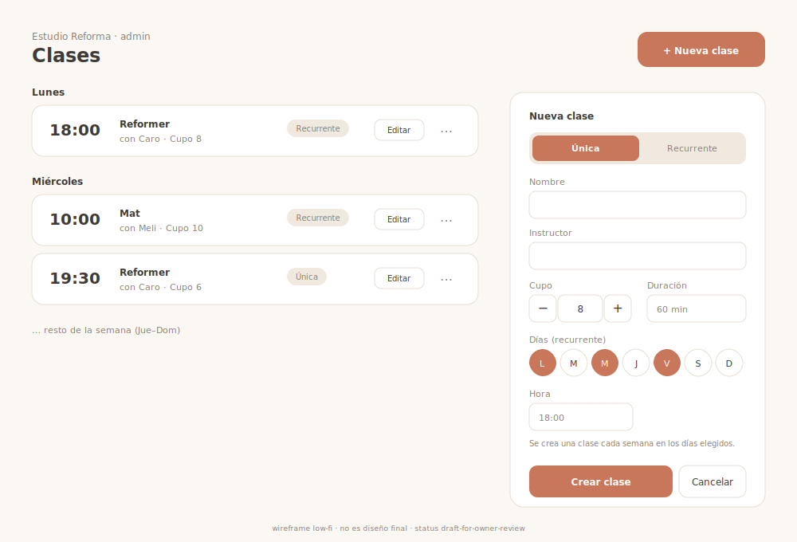

# Reference Lock — Admin: Crear / gestionar clases (Fase 1F)

> Pantalla **operativa de admin** (más Cat A que premium-hero), pero la sostenemos contra la
> **baseline StudioFlow** y un visual gate liviano por coherencia con el resto. Hereda la
> baseline de [README.md](README.md) (Soft UI Evolution · lienzo neutro cálido + acento del
> estudio + semánticos · Plus Jakarta Sans · Lucide · motion 150–300ms) y **reusa el lenguaje
> de la tarjeta de clase y el selector de día ya construidos** en el calendario del alumno.
> Síntesis de `technical-product-owner` (funcional) + `ui-ux-designer` (visual).

## Objetivo de pantalla
Que el dueño **arme y mantenga su grilla semanal sin fricción**: cree una clase única o
recurrente en menos de un minuto, fije cupo e instructor, y vea/gestione lo cargado. Es la
**fuente de la agenda** que el alumno reserva (`class_occurrences`).

## Usuario principal
**Dueño / admin** (no técnico). Carga inicial **desde la compu** (setup de grilla); ajustes
puntuales **desde el celular**. `reception` queda habilitado por RLS pero el MVP diseña para
admin. El alumno/instructor no escriben acá.

## Decisiones del owner (cerradas, 2026-06-26)
1. **Recurrencia multi-día:** una clase recurrente puede repetir en **varios días** (ej.
   Reformer lun/mié/vie 18:00) → se crean **varias `class_schedules` para la misma `classes`**
   (el schema lo soporta). El form usa **selector de días multi-selección**.
2. **Materialización vía RPC `SECURITY DEFINER`:** migración nueva (Fase 1F) con
   `materialize_schedule()` + cancelación por lote, aplicada a `syntraflow-dev`. Atomicidad +
   idempotencia (`on conflict`) + TZ/DST correcta en el motor.

---

## Alcance MVP (funcional)
**Entra:** crear clase **única** (1 `classes` + 1 `class_occurrences`, `schedule_id=null`);
crear clase **recurrente** (1 `classes` + N `class_schedules` por día elegido → materializa
ocurrencias **8 semanas**, parámetro extensible a 12); listar/ver clases (regla + próximas
ocurrencias); editar (metadatos + regla, con efecto solo sobre futuras **sin reservas**);
cancelar/archivar (soft-delete + refund por lote reusando la lógica de `cancel_reservation`);
cupo (default desde `studio_settings.default_capacity`); instructor como **texto informativo**.

**No entra (1F+):** promoción automática de waitlist · edición fina por ocurrencia ("esta y
siguientes", feriados, mover una) · rolling window automática · `booked_count` a mano ·
instructor con login/FK.

### Reglas funcionales clave
- **Materialización:** desde `max(valid_from, hoy)` hasta `min(valid_to, hoy+8sem)`, para cada
  fecha cuyo weekday ∈ días elegidos. `INSERT … ON CONFLICT (class_id, starts_at) DO NOTHING`
  (idempotente; nunca pisa ocurrencias con reservas).
- **TZ/DST:** el admin ingresa **hora local**; el servidor compone `starts_at` UTC con
  `AT TIME ZONE studios.timezone` **por fecha** (no offset fijo). `ends_at = starts_at + duration_min`.
- **Editar regla/cupo:** aplica a ocurrencias **futuras sin reservas**; **nunca** bajar
  `capacity` por debajo de `booked_count` (rechazo claro, no romper el CHECK). Futuras con
  reservas no se mueven solas.
- **Cancelar:** ocurrencia → `status='cancelled'` + reservas `cancelled` + libera cupo +
  refund donde corresponda (ventana/política/pack vigente). Archivar clase → `status='archived'`
  + cancelar ocurrencias futuras. **Hard-delete prohibido si hubo reservas.** Aviso in-app.
- **Validación 100% server-side (Zod)**; `studio_id` se deriva del usuario, nunca del payload.

### Backend (Fase 1F, requiere migración nueva — aprobada)
- RPC **`materialize_schedule(p_schedule_id uuid, p_weeks int default 8)`** `SECURITY DEFINER`,
  revalida `auth_has_role(studio_id, array['admin','reception'])`, deriva `studio_id` del
  schedule. RPC hermana para **cancelar clase/ocurrencia por lote** (reusa refund de `cancel_reservation`).
- CRUD de metadatos simples (renombrar, instructor) puede ir en server action bajo RLS.
- RLS ya cubre la autorización (`classes/schedules/occurrences_write_admin`). Sin policies nuevas.

---

## Visual Reference Direction

**Wireframe de referencia (propio, low-fi):**

> SVG low-fi: fija composición (lista + panel de creación), jerarquía y reuso del lenguaje del
> alumno. No es diseño final. `assets/crear-gestionar-clases-wireframe.svg`.

**Layout recomendado**
- *Mobile (prioridad):* header (estudio + "Clases") → **botón primario "Nueva clase"** evidente
  (no escondido) → **lista de clases agrupada por día** (tarjetas). Crear/editar = **hoja
  inferior (bottom sheet)** casi full-height (no modal apretado).
- *Desktop:* **2 columnas**. Izquierda (~8col): **grilla/lista semanal de clases** (llena el
  ancho con info útil). Derecha (~4col, sticky): **panel "Nueva clase"** fijo (el form vive ahí,
  **no un modal que tape la grilla** → ves la semana mientras cargás). Editar rellena el mismo panel.
- **Regla de no-vacío:** en desktop nunca una columna grande en blanco.

**Jerarquía:** botón "Nueva clase" (acción dominante) → día (agrupador) → hora + nombre →
cupo + instructor → badge tipo (única/recurrente) → acciones de gestión (secundarias).

**Componentes**
- **Tarjeta de clase admin** (deriva de `class-card.tsx`: `rounded-2xl`, `bg-card`, sombra suave,
  hora `text-2xl font-bold`, instructor con `User2`). **Cupo como dato de configuración** ("Cupo: 8"),
  **no** con el color semántico verde/ámbar/rojo del alumno (eso es ocupación, no config).
  **Badge tipo:** "Única" (neutro) / "Recurrente" (neutro/acento + `Repeat`). Acciones: Editar +
  menú (`MoreHorizontal`) pausar/archivar — en mobile **siempre visibles** (no solo hover).
- **Botón "Nueva clase":** `bg-primary` + `Plus` (mismo lenguaje que "Reservar" del alumno).
- **Form única/recurrente:**
  - **Toggle "Única / Recurrente"** como **primer control** (segmented `CalendarDays`/`Repeat`):
    define qué campos aparecen, transición suave sin layout shift.
  - Comunes: Nombre · Instructor · **Cupo (stepper − / +)** · Duración.
  - Única: **fecha + hora**. Recurrente: **selector de días multi-selección** (chips L M M J V S D,
    **reusando el lenguaje del selector de día del alumno**: activo `border-primary bg-primary
    text-primary-foreground`) + hora + vigencia (desde / hasta opcional).
  - Microcopy: "Se crea una clase cada semana en los días elegidos."
  - Footer: primario "Crear clase" / "Guardar" + "Cancelar".

**Tono:** cálido boutique, mismo lenguaje que la app del alumno ("es la misma app, del otro
lado"). Acento del estudio con mesura (botón, toggle, días activos). Tranquilo, de control.

**Estados:** vacío → "Todavía no cargaste clases" + subcopy + CTA (patrón del estado vacío del
alumno, orientado a crear). Carga → **skeletons** con forma de tarjeta. Error → banda
`destructive` + reintentar; en el form, error en el campo sin perder lo cargado. Éxito →
banda `success` ("Se crearon N ocurrencias"), la nueva clase aparece resaltada brevemente.

---

## Criterios de aprobación (binarios)

**Funcionales**
- [ ] Crear clase **única** futura → 1 `classes` + 1 `class_occurrences` (`schedule_id=null`, UTC correcto).
- [ ] Crear **recurrente multi-día** → ocurrencias de **cada día elegido** dentro de 8 semanas; ninguna en el pasado.
- [ ] **Idempotencia:** re-materializar no duplica (unique `(class_id, starts_at)` + on conflict), sin error al admin.
- [ ] **TZ/DST:** 09:00 local pre y post DST → `starts_at` UTC con offset correcto a cada fecha.
- [ ] Cancelar ocurrencia con reservas → `cancelled` + reservas `cancelled` + cupo liberado + refund donde corresponda; **nada se borra**.
- [ ] Bajar `capacity` < `booked_count` → falla con mensaje claro, sin estado inconsistente.
- [ ] `client` / otro estudio → no puede crear/editar/cancelar (RLS).
- [ ] Ocurrencias creadas → **visibles y reservables** en el calendario del alumno.

**Visuales**
- [ ] "Nueva clase" es la acción dominante, accesible sin scroll (mobile incluido).
- [ ] Crear sin salir de contexto (hoja en mobile / panel lateral en desktop), sin tapar la grilla en desktop.
- [ ] Toggle Única/Recurrente es el primer control y cambia campos sin layout shift brusco.
- [ ] Selector de días reusa el lenguaje del selector del alumno.
- [ ] Tarjetas con el mismo lenguaje visual que la card del alumno; **tipo** ≠ color semántico de cupo.
- [ ] Desktop aprovecha el ancho (grilla + panel) sin columnas vacías; estado vacío resuelto.
- [ ] Acento = color del estudio (mesura); base neutra cálida; no marca SYNTRA. Mobile 360–390 fluido, targets ≥44px.

## Riesgos
- **Editar regla con reservas:** acotado a "solo futuras sin reservas"; comunicar en UI qué se
  re-materializa y qué queda desfasado (no dar a entender que movió todo).
- **TZ/DST:** materializar en Postgres (`AT TIME ZONE`), no offset fijo en JS.
- **Ventana finita (8 sem) sin rolling window:** documentar que hay que re-materializar (al
  editar / job manual) para no quedarse sin futuro. Aceptable en MVP.
- **Refund por lote al cancelar:** reusar la lógica de `cancel_reservation` (no duplicar) para
  no descuadrar créditos.
- **Anti-patrones visuales:** planilla densa, calendario corporativo, SaaS frío, modal que tapa
  todo en desktop, form abrumador (mostrar única+recurrente a la vez), acento inundando, confundir
  tipo con estado, acciones solo-hover en mobile.

## Owner approval
Estado: approved · approved_by: owner · 2026-06-26

<!-- Lock APROBADO por el owner (2026-06-26). Habilita implementar Fase 1F bajo el visual gate.
     Decisiones cerradas: recurrencia multi-día + RPC SECURITY DEFINER para materializar. -->
Referencia visual aprobada: [assets/crear-gestionar-clases-wireframe.svg](assets/crear-gestionar-clases-wireframe.svg)
