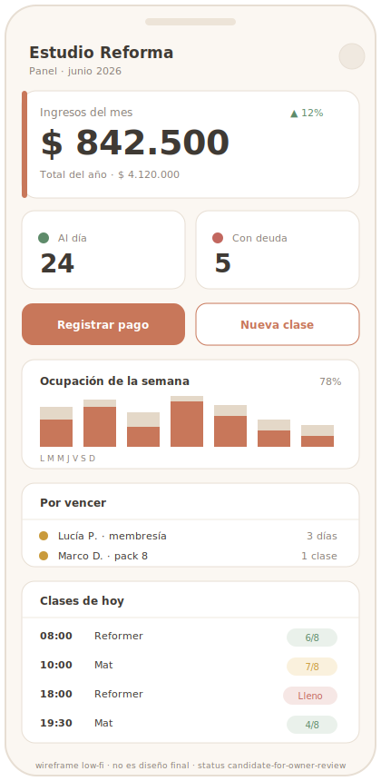

# Reference Lock — Dashboard financiero (admin)

## Objetivo de pantalla
Que el dueño entienda **el estado de su negocio en 5 segundos** al abrir la app: cuánto
entró, quién debe, qué tan llenas están las clases y qué vencimientos se vienen. Es la
pantalla-ancla de la venta (el "wow" del pitch) y el home del admin.

## Usuario principal
**Dueño / administrador del estudio** (no técnico). Lo usa a diario, muchas veces desde el
celular, entre clases. Secundario: recepción (Fase 2).

## Problema que resuelve
Hoy el dueño no tiene una foto clara de ingresos, deuda ni ocupación: lo lleva en la cabeza,
en Excel o preguntando. Esta pantalla le da **control del negocio sin cálculo manual**.

## Información prioritaria (orden)
1. **Ingresos del mes** (dato dominante) + total (secundario).
2. **Alumnos con deuda** (cantidad + acceso a la lista).
3. **Ocupación** (hoy / semana).
4. **Membresías vencidas / próximas a vencer.**
5. **Packs vendidos / clases sueltas vendidas** (mes).
6. **Próximas clases de hoy** (acceso rápido a anotados).
7. (Fase 2+) cancelaciones y no-shows.

## Jerarquía visual
- Fila superior: **KPIs financieros**, con ingresos del mes destacado.
- Banda de **alertas accionables** (deuda, vencimientos) — lo que requiere acción del dueño.
- Bloque de **operación de hoy** (clases + ocupación).
- Mobile-first: KPIs apilados, lo financiero primero; desktop: grilla de tarjetas.

## Componentes esperados
- Tarjetas KPI (valor + etiqueta + variación opcional).
- Lista compacta "alumnos con deuda" (nombre + monto/estado + CTA "ver ficha").
- Indicador de ocupación (barra o ratio reservado/cupo).
- Lista "clases de hoy" (hora + nombre + anotados/cupo).
- Filtro de período (mes actual por defecto).

## Estados vacíos
- **Estudio nuevo / sin pagos:** en vez de KPIs en cero fríos, mostrar onboarding cálido
  ("Cargá tus primeras clases y registrá un pago para ver tu negocio acá") con CTA.
- **Sin deuda / sin vencimientos:** mensaje positivo ("Todos al día ✅"), no una tabla vacía.
- **Sin clases hoy:** "No hay clases hoy" + acceso a la agenda.

## Estados de error
- Falla de carga de métricas → mensaje claro + reintentar; nunca números a medias que
  parezcan reales.
- Datos parcialmente disponibles → indicar qué no se pudo cargar, no romper toda la pantalla.

## Mobile-first
Prioridad absoluta: ingresos del mes + deuda visibles sin scroll en 360–390 px. KPIs
apilados; alertas como tarjetas tocables.

## Versión desktop / admin
Grilla de tarjetas (3–4 columnas) con más contexto: tendencias del mes, listas más largas,
filtros de período. Es donde el dueño "analiza"; el mobile es donde "chequea".

## Referencias visuales sugeridas
- Dashboard SaaS **simple** (tipo panel de Stripe/Linear en claridad y jerarquía, NO en
  densidad ni frialdad).
- Paneles de **negocios wellness/boutique** (lenguaje cálido, foco en personas y plata, no
  en métricas técnicas). *(Pendiente adjuntar imágenes en `assets/`.)*

## Riesgos UX
- **Sobrecargar de números** → máximo 4–5 KPIs; el resto, secundario.
- Mezclar informativo con accionable → separar alertas (acción) de métricas (lectura).
- Estados vacíos feos en estudios nuevos → diseñar onboarding.
- Tono punitivo con la deuda → informativo y orientado a la acción (cobrar/avisar).

## Criterios de aprobación
- [ ] Ingresos del mes se leen como dato dominante sin scroll (mobile incluido).
- [ ] Deuda y vencimientos visibles y accionables (llevan a ficha/lista).
- [ ] Ocupación del día comprensible de un vistazo.
- [ ] Estados vacíos resueltos (no tablas en cero frías).
- [ ] Usa la marca del estudio (color primario configurable), no la de SYNTRA.
- [ ] No parece template SaaS genérico (lenguaje y composición del rubro).

## Qué NO debe parecer
- Dashboard frío de fintech / panel de trading.
- Tablero saturado de widgets y tablas densas.
- Glassmorphism excesivo, neón IA, look crypto.
- Métricas técnicas ("usuarios/transacciones/items") en vez del rubro ("alumnos/pagos/clases").

## Qué debe sentirse al usarlo
Claridad y control. "En 5 segundos sé cómo va mi mes." Premium, cálido, profesional, simple
— un panel hecho para un dueño de estudio, no para un analista de datos.

## Riesgos técnicos / performance
- Métricas salen de agregaciones (`payments`, vista `member_financial_status`, ocurrencias)
  → cuidar consultas; considerar materialización/caché si crece.
- Cálculo de ingresos/deuda **server-side** y consistente con `credit_ledger`/`payments`.
- Carga rápida en mobile; sin errores de consola.

## Visual Reference Direction

> Hereda la **baseline compartida** de [README.md](README.md) (Soft UI Evolution · lienzo
> neutro cálido + acento del estudio + colores semánticos · Plus Jakarta Sans · Lucide ·
> motion 150–300ms). Acá, su aplicación a esta pantalla.

**Wireframe de referencia (propio, low-fi):**

> SVG low-fi, no es diseño final: fija composición, jerarquía y uso del color (acento del
> estudio + semánticos), no píxeles. `assets/dashboard-financiero-wireframe.svg`.

**Referencias / patrones sugeridos** (conceptuales, a traducir — no copiar literal):
- *Small-business / wellness dashboards*: foco en 4–5 números que le importan al dueño, no
  en gráficos densos.
- *Stripe Dashboard* (solo por claridad de KPIs y jerarquía), pero **más cálido** y con menos
  densidad.
- *Apps de gestión de estudios fitness*: tarjetas de resumen + lista de "hoy".

**Principios visuales:** claridad sobre completitud; un dato dominante por tarjeta; aire
generoso; color semántico para estado (verde/ámbar/rojo suave), acento del estudio solo en
acciones/énfasis.

**Layout recomendado:**
- *Mobile:* scroll vertical. Orden: (1) tarjeta-héroe **Ingresos del mes**, (2) fila de 2
  KPIs (al día / con deuda), (3) **acciones rápidas**, (4) ocupación semanal, (5) por vencer,
  (6) clases de hoy.
- *Desktop:* grilla 12-col; fila superior de 3–4 KPIs (ingresos destacado), banda de alertas
  (deuda / por vencer), bloque "hoy + ocupación" a 2 columnas.

**Jerarquía de información:** Ingresos del mes (nº 1) → deuda/al día → ocupación → packs/
membresías → clases de hoy → acciones rápidas (siempre accesibles).

**Componentes clave:** KPI card (valor grande + label + delta opcional), stat con badge de
estado, mini-barra de ocupación semanal (no gráfico pesado), lista "alumnos con deuda"
(avatar/inicial + nombre + monto + CTA), lista "clases de hoy", botones de acción rápida
("Registrar pago", "Nueva clase").

**Tono visual:** panel de negocio **tranquilo y confiable**, no centro de control financiero.
Cálido, ordenado, con foco.

**Interacción principal:** lectura de un vistazo + saltar a la acción (tocar deuda → ficha de
alumno; acción rápida → registrar pago / crear clase).

**Mobile-first:** Ingresos del mes + estado de deuda visibles sin scroll. Tarjetas tocables,
targets ≥ 44px.

**Desktop:** misma información, más contexto lateral (tendencia del mes, listas más largas,
filtro de período).

**Estados vacíos:** estudio nuevo → onboarding cálido ("Cargá tus clases y registrá un pago
para ver tu negocio acá") con CTA, no KPIs en cero. Sin deuda → mensaje positivo ("Todos al
día"). Sin clases hoy → acceso a la agenda.

**Estados de error:** falla de métricas → mensaje + reintentar; nunca números a medias que
parezcan reales. Skeleton durante la carga.

**Criterios de aprobación visual:**
- [ ] Ingresos del mes es el elemento dominante, sin scroll (mobile incluido).
- [ ] Estado (al día / deuda / por vencer) se lee por color **+** texto/ícono.
- [ ] Se siente cálido y tranquilo (no fintech/cripto/denso).
- [ ] Acento = color del estudio; base = neutro cálido; semánticos consistentes.
- [ ] Estados vacíos y de carga resueltos.
- [ ] Acciones rápidas siempre accesibles.

**Riesgos visuales:** caer en "panel de trading"; saturar de widgets/gráficos; usar gris
azulado frío; depender solo de color para el estado.

**Anti-patrones:** dashboard fintech denso · tablas extensas · glassmorphism · neón IA ·
look cripto · KPIs en cero fríos en estudios nuevos · jerga técnica ("transacciones/usuarios").

## Owner approval
Estado: candidate-for-owner-review

<!-- Owner: revisar la Visual Reference Direction y, si OK, pasar a 'approved'. Mientras no
     esté 'approved', no se toca código (Cat B/C). -->
