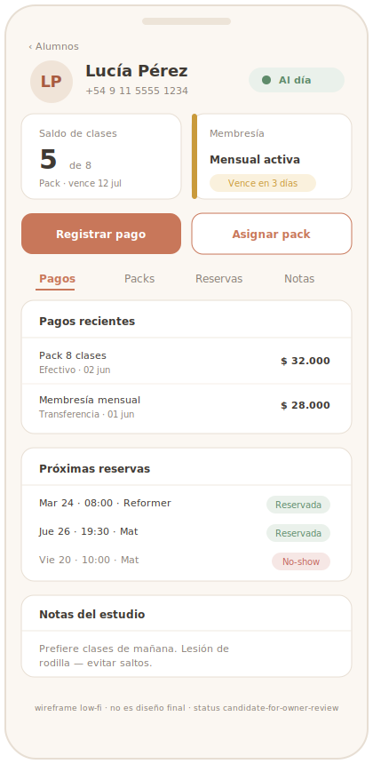

# Reference Lock — Ficha de alumno (admin)

## Objetivo de pantalla
Que el admin vea **todo lo relevante de un alumno en una pantalla** y pueda actuar: estado
financiero, saldo de clases, packs/membresías, historial de pagos y reservas. Es donde el
dueño "resuelve" a un alumno (cobra, asigna pack, revisa deuda).

## Usuario principal
**Dueño / administrador** (no técnico), a menudo en mostrador con el alumno enfrente,
muchas veces desde el celular. Secundario: recepción (Fase 2).

## Problema que resuelve
Hoy el dueño no sabe de un vistazo si el alumno está al día, cuántas clases le quedan o si
debe. Esta ficha centraliza eso y le permite **registrar el cobro en el momento**.

## Información prioritaria (orden)
1. **Estado financiero** (al día / debe / membresía vencida / próximo a vencer).
2. **Saldo de clases** (créditos) y **membresía activa** (con vencimiento).
3. **Acción: registrar pago** / **asignar pack o membresía**.
4. **Historial de pagos** (concepto, monto, método, fecha).
5. **Packs/membresías** (vigentes y vencidos).
6. **Reservas** (próximas + historial; no-shows).
7. Datos de contacto.

## Jerarquía visual
- Encabezado: nombre + **badge de estado financiero** (verde al día / alerta deuda).
- Bloque destacado: **saldo + membresía** y **CTA "Registrar pago"**.
- Secciones/pestañas: Pagos · Packs/Membresías · Reservas.
- Mobile-first (uso en mostrador): lo accionable arriba.

## Componentes esperados
- Badge de estado financiero (derivado de `member_financial_status`).
- Tarjeta de saldo (créditos) + tarjeta de membresía (con vencimiento).
- Botón/modal "Registrar pago" (concepto + monto + método).
- Botón/modal "Asignar pack / membresía" (con vencimiento).
- Tabla/lista de pagos; lista de packs/membresías (vigente/vencido); lista de reservas.

## Estados vacíos
- **Alumno nuevo, sin pagos ni packs:** ficha clara con CTA primario "Registrar primer pago
  / asignar pack"; sin tablas vacías frías.
- **Sin reservas todavía:** "Aún no reservó clases".
- **Sin membresía:** mostrar solo saldo de packs (o "Sin pack activo" + CTA).

## Estados de error
- Falla al registrar pago → no aplicar el beneficio a medias; mensaje claro + reintentar
  (la escritura es transaccional: o se aplica todo o nada).
- Estado financiero no disponible → indicar "no se pudo calcular", no mostrar un estado falso.
- Conflicto de concurrencia (dos cargas a la vez) → resolver server-side; informar resultado.

## Mobile-first
Operable en mostrador desde el celular: estado + saldo + "Registrar pago" arriba, accesibles
sin scroll. Modales de pago simples, con resumen antes de confirmar.

## Versión desktop / admin
Layout de dos columnas (resumen + secciones), historial más extenso visible, búsqueda/
filtros de pagos y reservas. Es la vista de "gestión" completa del alumno.

## Referencias visuales sugeridas
- **CRM liviano** (perfil de cliente claro, no un ERP denso) — claridad tipo
  Pipedrive/Notion-CRM **en simplicidad**.
- Vistas de **estado financiero / saldo de créditos** de apps de membresía/fitness.
  *(Pendiente adjuntar en `assets/`.)*

## Riesgos UX
- **Demasiada info junta** → priorizar estado + saldo + acción; el resto en secciones.
- Confundir crédito (pack) con membresía → distinguirlos visualmente (reglas distintas).
- Registrar pago incorrecto → modal con resumen y confirmación antes de guardar.
- No reflejar el efecto del pago → tras registrar, saldo/estado se actualizan a la vista.
- Mostrar la deuda de forma punitiva → tono informativo, orientado a cobrar/avisar.

## Criterios de aprobación
- [ ] El estado financiero se entiende al abrir la ficha.
- [ ] Saldo de créditos y membresía (con vencimiento) claros y diferenciados.
- [ ] Registrar pago y asignar pack se hacen sin salir de la ficha, con confirmación.
- [ ] Tras registrar un pago, el saldo/estado se actualiza visiblemente.
- [ ] Historial de pagos y reservas legible; estados de reserva claros.
- [ ] Estados vacíos y de error resueltos.
- [ ] Funciona en mobile; marca del estudio, no template genérico.

## Qué NO debe parecer
- ERP/CRM corporativo denso lleno de campos y tablas.
- Panel de fintech frío; glass excesivo; neón IA; look crypto.
- Pantalla saturada donde la acción principal (cobrar) se pierde.

## Qué debe sentirse al usarlo
Resolutivo y humano. "Veo cómo está el alumno y le cobro en 10 segundos." Cálido y
profesional, pensado para un dueño que atiende personas, no para un operador de sistema.

## Riesgos técnicos / performance
- Estado financiero derivado de `member_financial_status` + `credit_ledger`, consistente con
  lo que ve el alumno.
- Registrar pago = escritura sensible (server action/RPC) que aplica pack/membresía y crea
  asientos de ledger en una transacción; nunca insert directo del cliente.
- Carga rápida; sin errores de consola.

## Visual Reference Direction

> Hereda la **baseline compartida** de [README.md](README.md) (Soft UI Evolution · lienzo
> neutro cálido + acento del estudio + colores semánticos · Plus Jakarta Sans · Lucide ·
> motion 150–300ms). Acá, su aplicación a esta pantalla. Debe sentirse **CRM liviano**.

**Wireframe de referencia (propio, low-fi):**

> SVG low-fi, no es diseño final: fija composición CRM-liviano, jerarquía y diferenciación
> crédito-pack vs membresía + estado financiero, no píxeles. `assets/ficha-alumno-wireframe.svg`.

**Referencias / patrones sugeridos** (conceptuales, a traducir — no copiar literal):
- *CRM livianos* (perfil de cliente tipo Pipedrive/Notion-CRM): cabecera de identidad +
  estado + secciones, **sin** la densidad de un ERP.
- *Tarjetas de estado de suscripción / saldo de créditos* de apps de membresía/fitness.
- *Member profile* de apps wellness: foco en "cómo está esta persona" + acción.

**Principios visuales:** identidad + estado financiero arriba; saldo y membresía como datos
diferenciados; la acción de cobrar siempre a mano; historial en secciones, no en una tabla
gigante.

**Layout recomendado:**
- *Mobile:* header (nombre + **badge de estado financiero**) → bloque **saldo + membresía**
  → **acciones rápidas** ("Registrar pago", "Asignar pack") → secciones colapsables (Pagos ·
  Packs/Membresías · Reservas).
- *Desktop:* 2 columnas — izquierda resumen (identidad, estado, saldo, acciones), derecha
  secciones con historial más extenso y filtros.

**Jerarquía de información:** estado financiero → saldo de créditos / membresía (con
vencimiento) → acción (registrar pago / asignar pack) → pagos recientes → reservas (próximas
+ no-shows) → notas administrativas → contacto.

**Componentes clave:** badge de estado (verde al día / ámbar por vencer / rojo suave deuda);
**tarjeta de saldo de créditos** y **tarjeta de membresía** (diferenciadas, con vencimiento);
botón/modal "Registrar pago" (concepto + monto + método, con resumen y confirmación);
botón/modal "Asignar pack/membresía"; listas livianas de pagos y reservas; bloque de notas.

**Tono visual:** ficha **humana y resolutiva** — "cómo está el alumno y qué hago", no una
planilla. Cálido, claro, ordenado.

**Interacción principal:** ver estado → registrar pago / asignar pack sin salir de la ficha →
ver saldo/estado actualizarse al instante.

**Mobile-first:** uso en mostrador con el alumno enfrente: estado + saldo + "Registrar pago"
accesibles sin scroll; modales simples con resumen antes de confirmar.

**Desktop:** vista de gestión completa (2 columnas), historial extenso, búsqueda/filtros de
pagos y reservas.

**Estados vacíos:** alumno nuevo sin pagos/packs → CTA primario "Registrar primer pago /
asignar pack", sin tablas vacías. Sin reservas → "Aún no reservó clases". Sin membresía →
"Sin pack activo" + CTA.

**Estados de error:** falla al registrar pago → no aplicar el beneficio a medias (transacción
todo-o-nada) + reintentar; estado financiero no disponible → "no se pudo calcular", nunca un
estado falso; concurrencia → resolver server-side e informar resultado.

**Criterios de aprobación visual:**
- [ ] El estado financiero se entiende al abrir la ficha (color **+** texto).
- [ ] Saldo de créditos y membresía (con vencimiento) claros y **diferenciados**.
- [ ] Registrar pago / asignar pack se hacen sin salir de la ficha, con confirmación.
- [ ] Tras registrar, saldo/estado se actualizan visiblemente.
- [ ] Historial de pagos y reservas legible; estados de reserva claros.
- [ ] Se siente CRM liviano y humano, no ERP/tabla pesada.

**Riesgos visuales:** densidad tipo ERP; confundir crédito (pack) con membresía; acción de
cobrar perdida entre datos; deuda mostrada de forma punitiva (debe ser informativa).

**Anti-patrones:** CRM corporativo denso · tablas extensas · panel fintech frío · glass
excesivo · neón IA · look cripto · pantalla saturada donde "Registrar pago" se pierde.

## Owner approval
Estado: candidate-for-owner-review

<!-- Owner: revisar la Visual Reference Direction y, si OK, pasar a 'approved'. Mientras no
     esté 'approved', no se toca código (Cat B/C). -->
